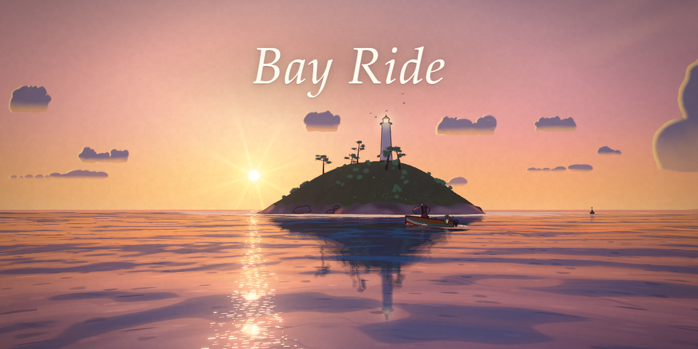

# Bay Ride

A summer evening in a small painted seaside bay, built in Three.js. Walk the timber pier and the
beach, then take a little wooden skiff out across the bay to the lighthouse island while the day
runs from morning to a moonlit night. There is nothing to win. Almost everything you see and hear
is generated in code at load time: the sea, the sky and clouds, the town, the trees and grass, the
birds, every sound and the music. The one authored model is the heroine, and a Python script builds
her in Blender. No textures, models, fonts or sounds were downloaded.



**Play it: https://starknightt.github.io/bay-ride/**

You need a desktop GPU, a keyboard and a mouse. It was built and measured in Chrome on an RTX 4060.
**The first visit takes up to a minute on Windows Chrome** while the sea's shader compiles. The
loading screen says so and keeps moving, and after that it starts almost at once.

## Running it locally

```
git clone https://github.com/StarKnightt/bay-ride.git
cd bay-ride
pnpm install
pnpm dev        # http://localhost:5431
pnpm build      # type-check, then a production build into dist/
pnpm preview    # serve dist/ on http://localhost:5430
```

The only runtime dependency is `three`. The build uses a relative base, so `dist/` works from any
sub-path. Every push to `master` builds the site and deploys it to GitHub Pages through
`.github/workflows/pages.yml`.

## Controls

| Input | Action |
|---|---|
| Click | Start; click again to capture the mouse for free look (Esc releases it) |
| Mouse | Look around; on foot, drag to orbit the camera and use the wheel to zoom |
| W A S D / arrow keys | Walk; in the boat, W and S are the throttle and A and D steer |
| Shift | Run; in the boat, full speed |
| Space | Jump |
| F | Next to the moored skiff, step aboard. In the boat, step ashore: at the berth, or beside any shore shallow enough to stand in, once the boat is slow |
| C | In the boat, cycle the cameras: chase, front, side |
| V | In the boat, first person and back |
| T | Next time of day |
| M | Music on or off |
| Shift + M | Mute everything |
| H or F1 | Show or hide the controls card |

The screen stays clean while you play. The loading screen shows the title and the controls, and
after that the controls card only appears when you press H.

| URL option | Effect |
|---|---|
| `tod=sunset` | Starts at `morning`, `noon`, `golden` (default), `sunset`, `dusk` or `night` |
| `timelapse=1` | Runs the whole day from morning to night |
| `autoplay=1` | She walks off along the pier by herself |
| `skipintro=1` | Starts as soon as the world is built instead of waiting for a click |
| `kuwahara=0` | Turns the paint filter off, for comparison |
| `msaa=0\|2\|4` | Sets the anti-aliasing level (4 by default) |

## What is in it

- **Painted water.** Wave trains bend round the bay and the island and break into lacy foam. The
  swash runs up the sand and drains back, leaving darker wet sand that dries unevenly. The shallows
  are clear over the sand and turn teal, then deep blue. The sun and the moon each lay a glitter
  path, and the pier, island and lit windows reflect in the water.
- **The boat.** A wooden skiff with an outboard that rides the real wave heights. It bobs, leans
  into turns and lifts its bow under throttle. It throws spray off the bow and leaves a V-shaped
  wake that fades out behind it. A lantern on the stern glows after sunset.
- **Six times of day.** Morning, noon, golden hour, sunset, dusk and night, each a full lighting
  preset that T blends between. At night the windows and pier lamps light up, the stars and moon
  come out, and the lighthouse beam sweeps the water.
- **The heroine.** An original character in a straw hat, a linen shirt and sunglasses. She walks,
  runs, jumps and wades, with her feet planted and IK on uneven ground. Her hair, ribbon and shirt
  move with the wind and the boat's speed, and she leaves footprints in wet sand. She walks down a
  stair to the landing stage to board, and can step off the boat at any shallow shore.
- **The bay.** A sandy beach under a coast road and a sea wall, and a hillside harbour town with
  stone lanes. There is a timber pier with fish boxes, rope coils and lobster pots, headlands,
  buoys, and an island with a lighthouse.
- **Life.** Swaying meadow grass, wildflowers and painted trees, gulls flying and perched,
  butterflies, fish that jump with a splash, drifting petals, and fireflies at night.
- **Sound, all synthesized.** Waves timed to the breakers on screen, water lapping the pier, the
  outboard rising with the throttle, hull slaps, gulls, wind, footsteps that change on wood, sand,
  stone and water, crickets at night, and a calm generative piano score that follows the time of
  day.

## How it works

### The heroine is a Blender script

`tools/character/build.py` runs headless in Blender. It models, rigs and animates her: the head,
body, hair, outfit, skeleton and clips are each a module in `tools/character/heroine/`. It exports
`public/models/heroine.glb`. The build is deterministic, so the same script always gives the same
file. In the game her materials are mapped onto the same toon shading and ink as everything else.

### Painterly post

The scene renders colour, normals, a surface id and depth in one pass. Ink outlines come from depth
and normal edges and from changes of id, and her lines thin with distance so she stays crisp far
away. An anisotropic Kuwahara filter turns the land into brush patches that follow the shapes while
the edges stay sharp. She and the boat are kept out of it. Bloom, a warm grade with a vignette and
paper grain, and a light sharpen finish the frame.

### Sound without samples

Nothing is recorded. Everything in `src/sound/` is built with the Web Audio API: noise buffers and
oscillators shaped into waves, wind, engine and footsteps, and a felt-piano and music-box score
composed as it plays. The mix goes through a warm tilt, a glue compressor, a limiter and a soft
ceiling, so it never clips.

### Nothing downloaded

There is no `TextureLoader`, `AudioLoader`, `fetch` or `new Image` in `src/`. The leaf atlas is
drawn on a canvas at load, and the loader's title uses the system's serif fonts. The one model
load is the heroine's GLB, which ships with the game and comes from the script above. The only
binary files in the repository are that GLB and `public/og.png`, the social preview image.

## Performance

At 1920x1080 on an RTX 4060, every view measured between 62 and 114 fps in the final check. The
one exception was a short dip to 58 fps at the very start of the walk, and the controller was
retuned for that afterwards. The scene renders at an adaptive resolution between 75 and 100 per
cent. It drops quickly when frames run long and climbs back slowly, so it doesn't pump.

Every shader program is compiled behind the loader, so nothing stalls once you are playing. On
Windows, Chrome translates WebGL to Direct3D, and the sea's shader takes most of the first visit's
wait. The browser caches the compiled shaders, so later visits start almost at once.

## Project structure

```
src/
  water/      sea, shoreline waves, swash and wet sand, wake, reflections
  boat/       the skiff, its spray, berth and boarding script
  rider/      the heroine: loading, animation, IK, face, footprints, on-foot and cameras
  world/      sky, time of day, terrain, pier, town, road and harbour detail
  flora/      grass, flowers and trees
  life/       gulls, butterflies, fish, drift and fireflies
  render/     toon materials, paint and ink, post, shader precompile
  sound/      the synthesized sound engine and score
  ui/         loader intro, first-time hints, help card
tools/character/   the Blender build script for the heroine
public/models/     heroine.glb, built by that script
```

## Limitations

- **Browsers.** Built and tested in Chrome on Windows. Other browsers are untested.
- **Hardware.** It needs a desktop-class GPU. There is no mobile or touch mode.
- **First visit.** The shader compile takes up to a minute in Windows Chrome before the first play.

## How it was built

It was built in Cursor by AI agents working in a builder and critic loop: a builder implemented each
pass, a critic compared rendered frames against reference stills and against the user's own
screenshots, and the findings went into the next pass. The user steered it throughout.

## Licence

MIT. See [LICENSE](LICENSE).
